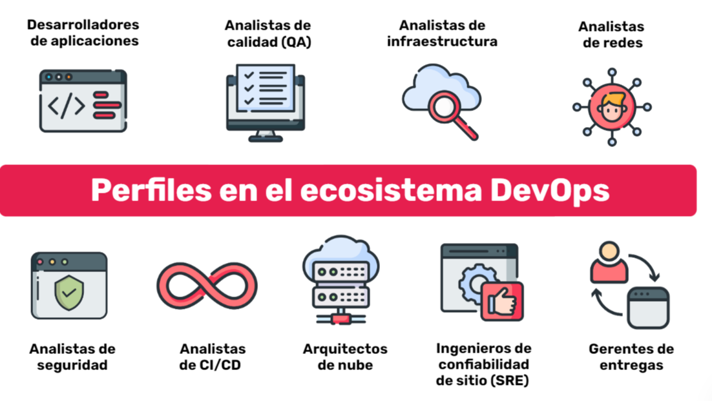

# Infra-II_DH
DevOps es la combinación de filosofías, prácticas y herramientas que incrementan la velocidad a la que una organización entrega aplicaciones y servicios, permitiendo mejorar los productos a un ritmo más rápido que las organizaciones que usen procesos de desarrollo e infraestructura tradicionales.

# Desarrolladores de aplicaciones:
## Son quienes desarrollan la aplicación, los programadores front-end, back-end, mobile, full stack o especializados en una tecnología particular —como Solidity—  o plataforma — por ejemplo, Internet de las cosas (IoT)—. En un entorno DevOps es importante que se comuniquen constantemente con los demás roles.

# Analista de calidad (QA)
## Son quienes verifican y validan la aplicación. En un entorno DevOps es importante que también se concentren en automatizar pruebas para hacerlas repetibles y confiables.

# Analistas de infraestructura
## Son quienes implementan la infraestructura sobre la cual se ejecutarán las aplicaciones y las bases de datos. También se ocupan del mantenimiento y la evolución de esta infraestructura. Buena parte de las prácticas de DevOps recaen sobre ellos, en especial la comunicación con quienes desarrollan la aplicación. Dado que muchas veces la infraestructura existe en la nube, también se los suele llamar analistas clouds o analistas de nube.

# Analistas de redes
## Se ocupan de la interconexión entre distintos sistemas, es decir, de las redes de computadoras —sean físicas o virtuales—. Es poco frecuente que se necesite una persona dedicada de forma exclusiva a las redes, es más común que este rol sea ocupado por el analista de infraestructura.

# Analistas de seguridad
## Son personas que trabajan en la seguridad de la aplicación y de la infraestructura. A veces no se dispone de un empleado por equipo dedicado de forma exclusiva a este rol. En esos casos es importante que todo el equipo reciba entrenamiento en seguridad.

# Analistas de CI/CD
## Definen la arquitectura del entorno en la nube: la estructura que tendrán los servidores, cómo se interconectan y varios aspectos de seguridad relacionados. También definen quiénes tendrán acceso a los distintos entornos. En organizaciones pequeñas no hay una persona dedicada de forma exclusiva a esto y la función recae sobre el analista de infraestructura.

# Arquitectos de nube
## Definen la arquitectura del entorno en la nube: la estructura que tendrán los servidores, cómo se interconectan y varios aspectos de seguridad relacionados. También definen quiénes tendrán acceso a los distintos entornos. En organizaciones pequeñas no hay una persona dedicada de forma exclusiva a esto y la función recae sobre el analista de infraestructura.

# Ingenieros de confiabilidad de sitio(SRE)
## Son los encargados de diseñar y monitorear el sistema para minimizar las suspensiones de servicio y el tiempo de recuperación de los servicios. Trabaja tanto de forma proactiva como reactiva, respondiendo a incidentes, pero también intentando que no ocurran o vuelvan a ocurrir.

# Gerentes de entregas
## En algunos casos no es posible realizar despliegue continuo, por limitaciones del mercado o por la naturaleza del producto —por ejemplo, cada despliegue significa inevitablemente una suspensión temporal del servicio o cada cliente requiere una versión distinta del producto—. En estos casos, el gerente de entregas se ocupa de coordinar la entrega de nuevas versiones del producto a los clientes, llevar registro de qué cliente tiene qué versión del producto y orientar los esfuerzos del equipo hacia la satisfacción de los clientes.